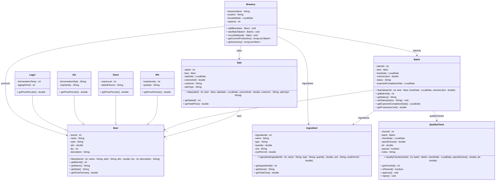

# Exercise 38 - Craft Brewery System

Implement the following class diagram in Java:

## Notes:
- Beer styles: "Pilsner", "Pale Ale", "Imperial Stout", "Hazy IPA", "Belgian Dubbel", etc.
- ABV (Alcohol By Volume): percentage, typical range 3-12%
- IBU (International Bitterness Units): typical range 10-100
- Lager pricing: 80 kr/L base + 5 kr/L for each week of laging
- Ale pricing: 85 kr/L base + 10 kr/L if hop variety is "Premium"
- Stout pricing: 90 kr/L base + 15 kr/L for roast level 8+
- IPA pricing: 95 kr/L base + 20 kr/L for hop intensity > 7
- Batch status: "Brewing", "Fermenting", "Conditioning", "Quality Check", "Ready", "Bottled", "Rejected"
- Ingredient types: "Malt", "Hops", "Yeast", "Water", "Adjunct"
- Production timeline: Lager (4-8 weeks), Ale (2-4 weeks), Stout (3-6 weeks), IPA (2-3 weeks)
- Sale types: "Tap Room", "Distribution", "Retail", "Online"
- Quality check pH range: 4.0-4.5 (optimal for beer)
- Specific gravity: measures sugar content and fermentation progress
- Minimum 2 quality checks per batch required
- Use `java.time.LocalDate` for dates

## Extensions:

### Brewery
- **Current fields:** `breweryName : String`, `location : String`, `foundedDate : LocalDate`, `capacity : int`
- **Possible extensions:** `owner : String`, `employeeCount : int`, `annualProduction : double`, `awards : ArrayList<String>`, `website : String`, `socialMedia : ArrayList<String>`, `toursAvailable : boolean`

### Beer
- **Current fields:** `beerId : int`, `name : String`, `style : String`, `abv : double`, `ibu : int`, `description : String`
- **Possible extensions:** `color : String`, `servingTemperature : int`, `glassware : String`, `foodPairings : ArrayList<String>`, `awards : ArrayList<String>`, `seasonal : boolean`, `limitedEdition : boolean`
- **Current subclasses:** `Lager`, `Ale`, `Stout`, `IPA`
- **Possible subclasses:** `Pilsner`, `WheatBeer`, `Porter`, `SourBeer`, `BelgianAle`, `BarleyWine`, `Saison`

### Lager
- **Current fields:** `fermentationTemp : int`, `lagingPeriod : int`
- **Possible extensions:** `yeastStrain : String`, `clarity : String`, `carbonationLevel : int`

### Ale
- **Current fields:** `fermentationStyle : String`, `hopVariety : String`
- **Possible extensions:** `yeastType : String`, `maltProfile : String`, `bitternessLevel : int`

### Stout
- **Current fields:** `roastLevel : int`, `addedFlavors : String`
- **Possible extensions:** `chocolateNotes : boolean`, `coffeeNotes : boolean`, `nitrogenated : boolean`, `viscosity : String`

### IPA
- **Current fields:** `hopIntensity : int`, `ipaStyle : String`
- **Possible extensions:** `hopVarieties : ArrayList<String>`, `dryHopped : boolean`, `hazy : boolean`, `alcoholContent : double`

### Batch
- **Current fields:** `batchId : int`, `beer : Beer`, `brewDate : LocalDate`, `volumeLiters : double`, `status : String`, `expectedCompletionDate : LocalDate`
- **Possible extensions:** `actualCompletionDate : LocalDate`, `brewer : String`, `equipmentUsed : ArrayList<String>`, `notes : String`, `wastePercentage : double`, `productionCost : double`

### Ingredient
- **Current fields:** `ingredientId : int`, `name : String`, `type : String`, `quantity : double`, `unit : String`, `costPerUnit : double`
- **Possible extensions:** `supplier : String`, `origin : String`, `qualityGrade : String`, `expirationDate : LocalDate`, `storageConditions : String`

### Sale
- **Current fields:** `saleId : int`, `beer : Beer`, `saleDate : LocalDate`, `volumeSold : double`, `customer : String`, `saleType : String`
- **Possible extensions:** `unitPrice : double`, `discount : double`, `paymentMethod : String`, `invoiceNumber : String`, `deliveryAddress : String`, `orderStatus : String`

### QualityCheck
- **Current fields:** `checkId : int`, `batch : Batch`, `checkDate : LocalDate`, `specificGravity : double`, `ph : double`, `passed : boolean`, `notes : String`
- **Possible extensions:** `inspector : String`, `temperature : double`, `color : String`, `aroma : String`, `taste : String`, `clarity : String`, `recommendations : String`

