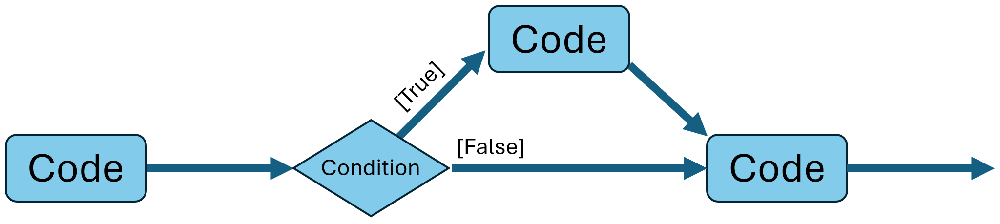

# Introduction

The "if-statement" is a fundamental _control structure_ in programming that allows you to execute a block of code conditionally, based on whether a specified condition evaluates to true or false. This is essential for making decisions in your code.

Consider the diagram below. Your code is executing sequentially, one statement at a time. Execution reaches an if-statement, with a _condition_, which is evaluated.
If the condition is true, a specific block of code is executed. If the condition is false, that block of code is _not_ executed.\
Then execution continues with whatever statements you have after the if-statement.

