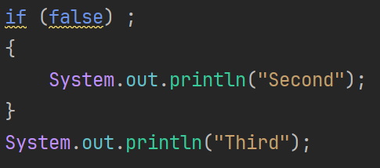

# A classic problem

One of the most common mistakes, when starting out with if-statements, will be described in the following.

Consider this code snippet:

```java
System.out.println("First");
if (false); 
{
    System.out.println("Second");
}
System.out.println("Third");
```

What do you think the output will be? A hint: it's a trick question.

Try running the code in IntelliJ.

<hint title="Hint">

The output will be:
```
First
Second
Third
```

</hint>

And why is the output like this? Why is `Second` printed? The if-condition is `false`, so the body should not be executed, right?

If I copy the code into IntelliJ, I will see yellow squiggly lines. These indicate a warning. I.e. you _may_ have a problem here.\
The red lines will prevent your program from running. The yellow lines will not prevent your program from running, but they indicate that you may have a problem in your code.

What is the problem here? If you hover over the `if` part?


Why does the if-statement have an empty body? Clearly, there is a print-out of "Second" in the code, so it should not be empty.

Remember, that you can auto-format your code by pressing <kbd>Ctrl</kbd> + <kbd>Alt</kbd> + <kbd>L</kbd>  in IntelliJ. This will make sure that the code is formatted nicely, and it will also help you see the structure of your code.

Then your code looks like this:



See that floating `;` after the `if(..)`? This is the problem. The `;` is used to end a _statement_ in Java, even if that statement is empty and does nothing.\
So, if I reformat a bit for clarity, your code is actually:

```java
System.out.println("First");
if (false)
    ; 

{
    System.out.println("Second");
}

System.out.println("Third");
```

And, because if your if-statement contains a single statement, you _don't_ actually need to explicitly use `{}` to define the body of the if-statement.\
So, the following code is actually valid. Notice the if has no clear body defined by `{}`:

```java
System.out.println("First");

if (false)
    System.out.println("Second");

System.out.println("Third");
```

Personally, I never leave out the braces, it invites errors into your code.

But, in our example, the body (which is not using `{}`) of the if-statement contains just that single empty statement.

```java
if (false)
    ; 
```

You are also allowed to insert braces in your code, somewhat "arbitrarily", to make it more readable. For example, you could write:

```java
System.out.println("First");
{
    System.out.println("Second");
}
System.out.println("Third");
```

The above is valid, and works, even though it looks a bit strange. 

This is because the braces `{}` are used to define a _block_ of code, and you can use them to group statements together.

So, in conclusion, _do not_ put a semi-colon after your if-statement. It will create an empty statement, and the body of the if-statement will be empty.