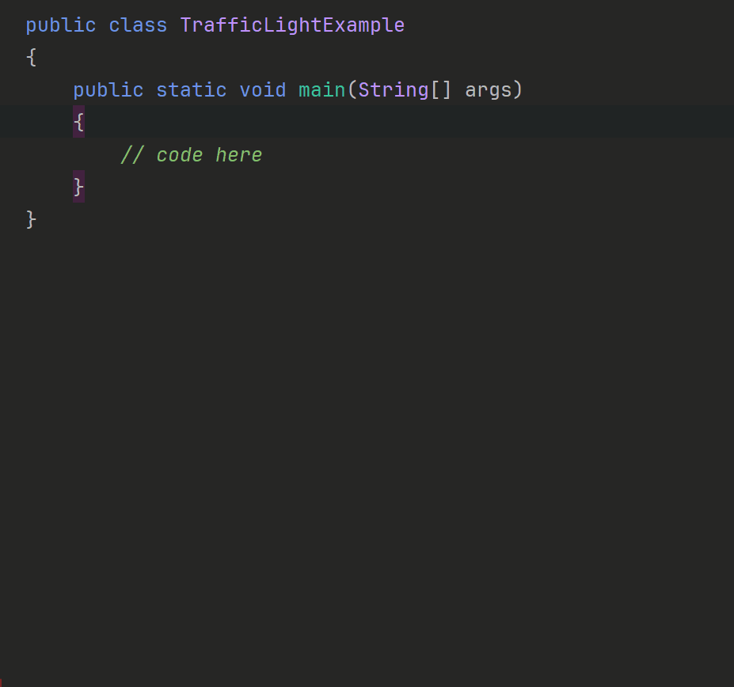

# Enum in a Separate File

So far, we have defined enums within the same file as our main method. However, it is a good practice to define enums in their own file. This makes your code cleaner and easier to maintain.

We will throughout the course write larger and larger programs, and these will naturally span many files. Keeping enums in their own file helps to keep the code organized.

Consider the previous traffic light example. Instead of defining the `TrafficLight` enum inside the file with the main method, we can create a separate file for it. As a reminder, here is what the traffic light file looked like, with less relevant parts cut out:

```java
public class TrafficLightExample {

    public static void main(String[] args) {
        // code here
    }

}

enum TrafficLight {
    RED,
    YELLOW,
    GREEN;
}
```

Now, instead of having the enum here, we want to create a new file called `TrafficLight.java` and move the enum definition there. The `TrafficLightExample.java` file will then look like this:

```java
public class TrafficLightExample {
 
    public static void main(String[] args) {
            // code here
    }

}
```

And the `TrafficLight.java` file will look like this:

```java
public enum TrafficLight {
    RED,
    YELLOW,
    GREEN;
}
```

Notice, we now have the `public` access modifier for the enum.

So, here is how we create the `TrafficLight` enum in its own file:



Now, the `TrafficLight` enum is defined in its own file, making it easier to manage and reuse in other parts of your program, when we get to that point in the course.

Notice how I have both the Example file and the enum file in the same package. If they were in different packages, we would need to import the `TrafficLight` enum in the `TrafficLightExample` class. Similar to what we do with the `Scanner` class.