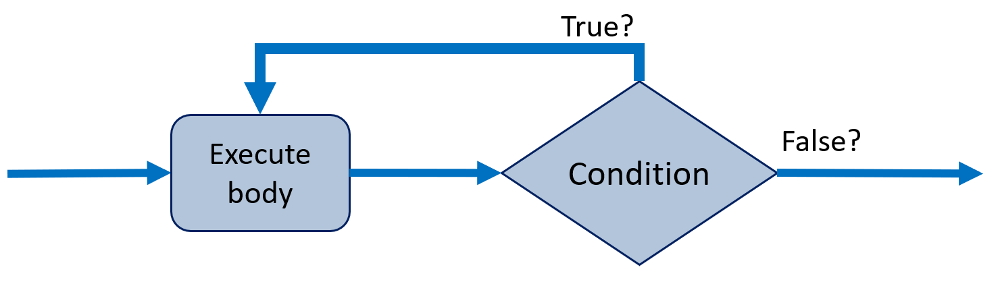

# The do-while loop

The `do-while` loop is similar to the `while` loop, but it guarantees that the loop body will execute **_at least once_**. The condition is evaluated **_after_** the loop body is executed.

### Syntax:

Here we start with a `do` block, and then a while with a condition.

```java
do 
{
    // Code to execute
} while (condition);

```

Here's a diagram to visualize the `do-while` loop:



### Key Points:
- The loop body is executed first, and then the condition is evaluated.
- If the condition is `true`, the loop continues; otherwise, it stops. But the body has been executed _at least once_.

## Example 1: Print Numbers from 1 to 5
This example demonstrates a simple `do-while` loop, printing numbers from 1 to 5:

```java
public class DoWhileExample 
{
    public static void main(String[] args) 
    {
        int i = 1;
        do 
        {
            System.out.println(i);
            i++;
        } while (i <= 5);
    }
}
```

### Output:
```
1
2
3
4
5
```

## Example 2: User Input Validation
This example asks the user to input a positive number. If the input is not positive, the loop repeats:

```java
import java.util.Scanner;

public class InputValidationExample 
{
    public static void main(String[] args) 
    {
        Scanner scanner = new Scanner(System.in);
        int number;
        do 
        {
            System.out.print("Enter a positive number: ");
            number = scanner.nextInt();
        } while (number <= 0);

        System.out.println("You entered: " + number);
    }
}
```

### Example Output:
```
Enter a positive number: -5
Enter a positive number: 0
Enter a positive number: 7
You entered: 7
```

The example could be improved by providing the user with an error message, when incorrect input is entered.

## Example 3: Request Hello World Input

And just re-doing the example from the `while` loop, but using a `do-while` loop instead:

```java
import java.util.Scanner;

public class HelloWorldExample 
{
    public static void main(String[] args) 
    {
        Scanner scanner = new Scanner(System.in);
        String input;
        do 
        {
            System.out.print("Please enter 'Hello World': ");
            input = scanner.nextLine();
        } while ( ! input.equals("Hello World"));

        System.out.println("Success! You entered 'Hello World'. That was very well done! Praise to you!");
    }
}
```

Notice that in this kind of situation, the `do-while` loop is particularly useful because it ensures that the user is prompted at least once, even if the condition is not met initially.

However, the two loop-versions are so similar, that I personally never use the do-while-loop. I simply forget it exists.