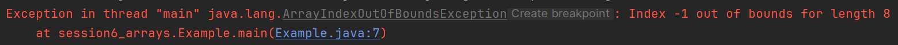

# Exercises - round 1

These exercises will help you practice the basic operations with arrays: creating arrays, adding elements to them, retrieving elements, and printing them out.

## Exercise 0: Default values in Arrays

Create an array of integers with a size of 5. 

```java
int[] numbers = new int[5];
```

Now, extract the value at any index, and print it out. What do you see?

<hint title="Hint 1">

When you create an array in Java, it initializes all elements to their default values. For integers, the default value is 0.

</hint>

Try the same again, with a String array:

```java
String[] names = new String[3];
```

And then a boolean array:

```java
boolean[] flags = new boolean[3];
```

Whenever you create an array, Java automatically fills it with default values based on the type of the array. For `String` arrays, the default value is `null`, and for `boolean` arrays, it is `false`, etc.

## Exercise 1: Out of bounds

What happens, if you try to access an index that is out of bounds in an array? I.e. an invalid index, like -1 or 5 in the case of an array of size 5?

First, create an array of integers with a size of 5:

```java
int[] numbers = new int[5];
```

Now, try to access an index that is out of bounds, like -1 or 5, and print the value at that index (why is 5 out of bounds? What is the _index_ of the last element in an array of size 5?).

What happens? 

<hint title="Hint 1">

When you try to access an index that is out of bounds, Java will throw an `ArrayIndexOutOfBoundsException`. This is a runtime exception that indicates you are trying to access an index that does not exist in the array.

In my case, IntelliJ IDEA shows the following error message:



You can see at which line the error occurred, highlighted in blue, here it's line 7.

</hint>

## Exercise 2: Store and Print Student Ages

Write a Java program that creates an array to store the ages of 5 students. Fill the array with the following ages: 18, 19, 20, 17, and 21. Then print out each age along with the student number.

### Example Output:
```
Student 1 is 18 years old
Student 2 is 19 years old
Student 3 is 20 years old
Student 4 is 17 years old
Student 5 is 21 years old
```

<hint title="Hint 1">

Create an integer array with size 5, then assign values to each position using array indices (0, 1, 2, 3, 4). Print out each value individually using System.out.println().

</hint>

<hint title="Solution">

```java
public class StudentAges {
    public static void main(String[] args) {
        // Create an array to store 5 student ages
        int[] ages = new int[5];
        
        // Add ages to the array
        ages[0] = 18;
        ages[1] = 19;
        ages[2] = 20;
        ages[3] = 17;
        ages[4] = 21;
        
        // Print out each age
        System.out.println("Student 1 is " + ages[0] + " years old");
        System.out.println("Student 2 is " + ages[1] + " years old");
        System.out.println("Student 3 is " + ages[2] + " years old");
        System.out.println("Student 4 is " + ages[3] + " years old");
        System.out.println("Student 5 is " + ages[4] + " years old");
    }
}
```

</hint>

## Exercise 2: Sum of Array Elements

Write a Java program that:
1. Creates an array of integers with size 5
2. Reads 5 numbers from the console and stores them in the array
3. Extracts the numbers from the array and calculates their sum
4. Prints the sum

### Example Input:
```
Enter number 1: 10
Enter number 2: 20
Enter number 3: 5
Enter number 4: 15
Enter number 5: 25
```

### Example Output:
```
The sum of all numbers is: 75
```

<hint title="Hint 1">

Create an integer array with size 5. Use Scanner to read input from the console. Store each number at a specific array index (0, 1, 2, 3, 4). Then add all array elements together by accessing each index individually.

</hint>

<hint title="Solution">

```java
import java.util.Scanner;

public class ArraySum {
    public static void main(String[] args) {
        Scanner scanner = new Scanner(System.in);
        
        // Create an array to store 5 numbers
        int[] numbers = new int[5];
        
        // Read 5 numbers from console and store them in the array
        System.out.print("Enter number 1: ");
        numbers[0] = scanner.nextInt();
        
        System.out.print("Enter number 2: ");
        numbers[1] = scanner.nextInt();
        
        System.out.print("Enter number 3: ");
        numbers[2] = scanner.nextInt();
        
        System.out.print("Enter number 4: ");
        numbers[3] = scanner.nextInt();
        
        System.out.print("Enter number 5: ");
        numbers[4] = scanner.nextInt();
        
        // Calculate the sum by extracting numbers from the array
        int sum = numbers[0] + numbers[1] + numbers[2] + numbers[3] + numbers[4];
        
        // Print the sum
        System.out.println("The sum of all numbers is: " + sum);
    }
}
```

</hint>

## Exercise 3: Mismatching types

What happens if you try to assign a value of a different type to an array element? For example, if you have an array of integers and try to assign a string to one of its elements?
Create an integer array with a size of 3:

```java
int[] numbers = new int[3];
```
Now, try to assign a string value to one of the elements, like this:

```java
numbers[0] = "Hello";
```
What happens?

<hint title="Hint 1">

You will get a compile-time error because you are trying to assign a string to an integer array element. Java is "strongly typed", so it enforces type compatibility. Unlike stupid JavaScript!

</hint>

## Exercise 4: Print array

The array type comes with a pre-built formatting, when printing it out.

It does require access to a utility class called `Arrays`, so you need to import it first:

```java
import java.util.Arrays;
```

Remember how you also imported the Scanner to read from the console? This is similar.

Create an array of integers with the values {1, 2, 3, 4, 5}, and print it out: like this:

```java
public class PrintArray {
    public static void main(String[] args) {
        int[] numbers = {1, 2, 3, 4, 5};
        System.out.println(Arrays.toString(numbers)); // note the use of Arrays.toString(...), this will format the array nicely
    }
}
```

Give it a try, and see what happens.

Alternatively, you can store the formatted string in a variable, and print it out later:

```java
public class PrintArray {
    public static void main(String[] args) {
        int[] numbers = {1, 2, 3, 4, 5};
        String formattedArray = Arrays.toString(numbers);
        System.out.println(formattedArray);
    }
}
```