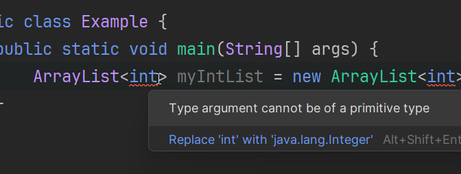

# Declaring the List

As you saw in the video, when you declare a List in Java, you need to specify the type of elements it will hold. That is done with for example `ArrayList<String>`, which means that the list will hold `String` elements.

The `< >` are called "angle brackets" or "chevrons". 

## Exercise 1: Declaring a List of ints

Try to create a program with the following code:

```java
import java.util.ArrayList;
public class Main {
    public static void main(String[] args) {
        ArrayList<int> myList = new ArrayList<>();
    }
}
```

What happens? And what does it mean?

<hint title="Explanation">



In Java, you cannot use primitive types (like `int`, `char`, etc.) as type parameters for generic classes (like `ArrayList`). Instead, you must use their wrapper classes (like `Integer`, `Character`, etc.). So, to declare an ArrayList of integers, you should use `ArrayList<Integer>`.

The `int` is a primitive type, while `Integer` is an object type (wrapper class) that represents an `int` value. The Java Collections Framework (which includes `ArrayList`) works with objects, not primitive types.

Java provides automatic conversion between primitive types and their corresponding wrapper classes, a feature known as "autoboxing" and "unboxing". This means you can add an `int` to an `ArrayList<Integer>` without explicitly converting it to an `Integer`.

```java
import java.util.ArrayList;
public class Main {
    public static void main(String[] args) {
        ArrayList<Integer> myList = new ArrayList<>();
        myList.add(5); // Autoboxing: int to Integer
        int value = myList.get(0); // Unboxing: Integer to int
    }
}
```

</hint>

## Exercise 2: Fixing the problem

Now, try to fix the code by changing `ArrayList<int>` to `ArrayList<Integer>`. Your code should look like this:

```java
import java.util.ArrayList;
public class Main {
    public static void main(String[] args) {
        ArrayList<Integer> myList = new ArrayList<>();
    }
}
```

Now, the code should compile without errors. You have successfully declared an `ArrayList` that can hold `Integer` objects.
