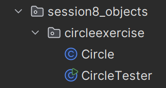
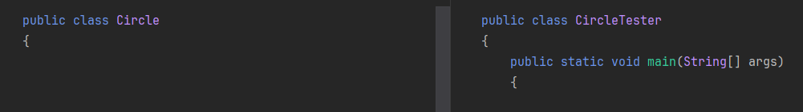

# Constructors in Java

A constructor is a special method in a class that is called when an object is created. 

It is also called in a special way, using the `new` keyword. For example:

```java
Person p = new Person();
```

Its main job, besides actually creating the object, is to initialize the object's fields.

## Default Constructor

If you do not write any constructor in your class, Java automatically provides a _default_ constructor with no parameters. This constructor does nothing except create the object.

```java
public class Person {
    // No constructor defined, so Java provides a default one
    private String name;
    private int age;
}


Person p = new Person(); // Calls the default constructor
```

## Exercise 4.0: Circle class

Create a Circle class, and leave it empty for now. Then create another class with a main method that creates a Circle object using the default constructor.

You should now have two files in a package, one for the Circle class, and one for the main method:




The Circle class:

```java
public class Circle {
    // No constructor defined, so Java provides a default one
}
```

And the CircleTest class:

```java
public class CircleTest {
    public static void main(String[] args) {
        Circle c = new Circle();
    }
}
```


Add a display() method to the Circle class that prints out "Circle" when called. Call this method from the main method.

### Hint
To format the display output, there are a few "string codes" you can use:

* "\n" will create a new line
* "\t" will create a tab space
  

## Exercise 4.1: Circle properties

Add the following field variables to the Circle class:

* `radius` (double)
* `color` (String)
* `diameter` (double)
  
Update the `display()` method to print out the radius, diameter, and color of the circle.

As in the video on the previous page, you should see that the field variables are initialized to their default values (0.0 for `radius` and `diameter`, and `null` for `color`) when you create a new Circle object.


## Custom Constructor

You can define your own constructor to set initial values for the fields when the object is created.

```java
public class Person {
    private String name;
    private int age;

    // Custom constructor
    public Person(String name, int age) {
        this.name = name;
        this.age = age;
    }
}

// ------------------------------------------------------------

Person p = new Person("Alice", 25); // Calls the custom constructor
Person p2 = new Person("Bob", 30); // Another object with different values
```

## Exercise 4.2: Custom constructor

Now, to your circle, you will add a custom constructor that takes the radius and color as parameters. 

Notice you do not need to set the diameter, as it can be calculated from the radius (diameter = 2 * radius).

So, in your constructor, which has parameters for `radius` and `color`, you must also assign the `diameter` field variable to `2 * radius`.

Run the program again, to inspect and verify the result.


## Constructor Overloading

You can have multiple constructors in a class, as long as they have different parameter lists. This is called constructor _overloading_.

```java
public class Person {
    private String name;
    private int age;

    // No-argument constructor
    public Person() {
        this.name = "Unknown";
        this.age = 0;
    }

    // Constructor with one argument
    public Person(String name) {
        this.name = name;
        this.age = 0;
    }

    // Constructor with two arguments
    public Person(String name, int age) {
        this.name = name;
        this.age = age;
    }
}

Person p1 = new Person(); // Uses no-argument constructor
Person p2 = new Person("Bob"); // Uses one-argument constructor
Person p3 = new Person("Charlie", 30); // Uses two-argument constructor
```

Constructor overloading allows you to create objects in different ways, depending on what information you have at the time.

## Exercise 4.3: Circle with Overloaded Constructors
Add another constructor to your Circle class that takes only the diameter as a parameter.

This constructor should calculate and set the radius (radius = diameter / 2) and also set the color to "unknown".

Create another instance of Circle using this new constructor and call the `display()` method to see the values.

```java
Circle c2 = new Circle(10.0);
c2.display();
```

## Video

Want a different angle on constructors? John explains them in 8 minutes:

<video src="https://www.youtube.com/watch?v=pgBk8HC7jbU"></video>