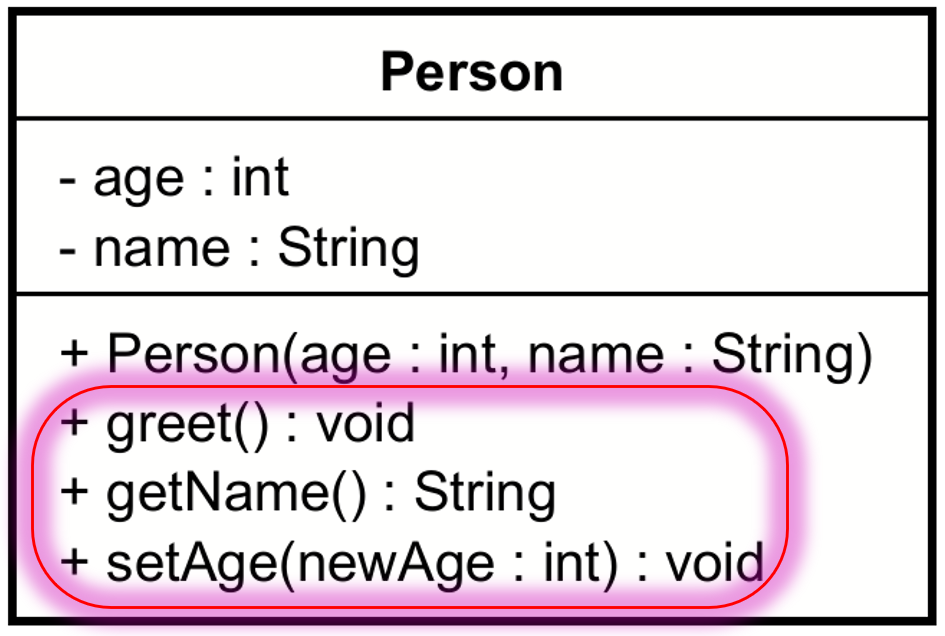

# Methods

In UML, methods are represented in the bottom compartment of the class diagram. They are shown with their visibility (public, private, protected) and their parameters.

For example, the `getName()` method from the previous example is public and have no parameters.\
The `setAge()` method is public and has one parameter, `age`, of type `int`.



The corresponding Java code:

```java
public class Person {
    private String name;
    private int age;

    public Person(String name, int age) {
        this.name = name;
        this.age = age;
    }

    public void greet() {
        System.out.println("Hello, my name is " + name + " and I am " + age + " years old.");
    }

    public String getName() {
        return name;
    }

    public int setAge(int age) {
        this.age = age;
    }
}
```

Notice the public visibility of the methods in the above snippet.

Methods can also be private in Java, in which case you just mark them with `-` in UML.