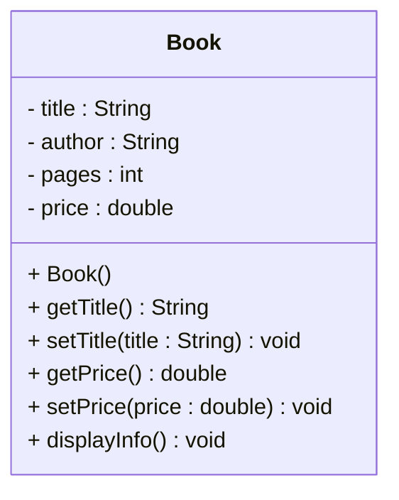
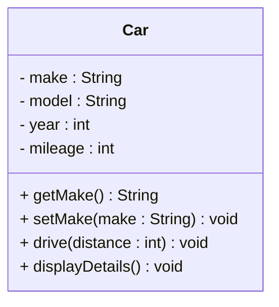
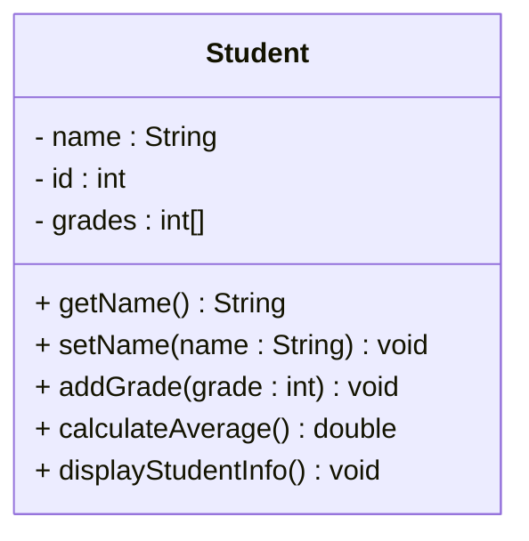

# Exercises - Round 1

The following exercises will help you practice reading UML class diagrams and implementing them in Java. For each exercise, you are provided with a UML diagram of a single class. Your task is to implement the class in Java, including its attributes and methods.

## Exercise 08.0: Book Class

Observe the UML diagram below.

### Task:
1. Implement the `Book` class in Java with the attributes and methods shown in the UML diagram.
2. Create a `main` method to test the class by creating a `Book` object, setting its attributes, and displaying its information.

**Optional**: you may add parameters to the constructor, or you can use the set-methods after a Book object has been created.

## Exercise 08.1: Car Class

Observe the UML diagram below.

### Task:
1. Implement the `Car` class in Java with the attributes and methods shown in the UML diagram.
2. Create a `main` method to test the class by creating a `Car` object, setting its attributes, driving a certain distance, and displaying its details.

**Optional**: you may add a constructor with parameters, or you can use the set-methods after a Car object has been created.

## Exercise 08.2: Student Class

### UML Diagram:

### Task:
1. Implement the `Student` class in Java with the attributes and methods shown in the UML diagram.
2. Create a `main` method to test the class by creating a `Student` object, setting its attributes, calculating the average grade, and displaying the student's information.

**Optional**: you may add a constructor with parameters, or you can use the set-methods after a Student object has been created.