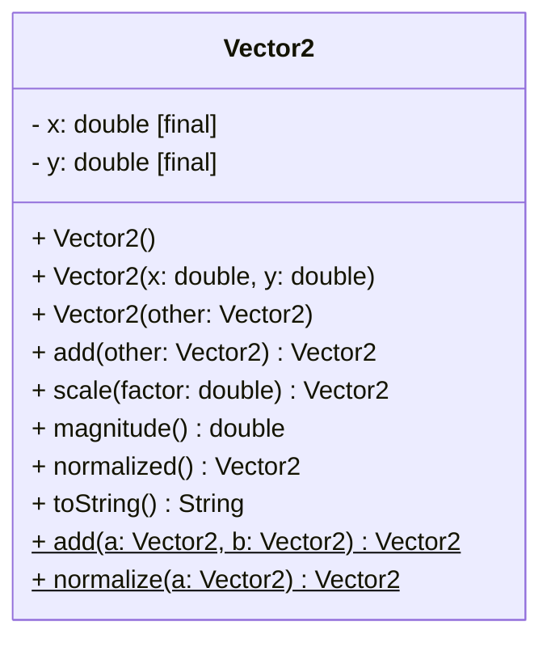

# Vector (2D) Exercise

Implement a 2D `Vector2` class that models a vector in the plane.\
The class will have instance fields, multiple constructors, and static utility methods.\
Write a small `main` program to demonstrate and test the features.

**UML class diagram:**
Notice there is no way to mark something `final` in UML. I have cheated by inventing my own way to show `[final]` on the two instance fields. 

**Requirements:**

Instance fields: 
- `x: double`
- `y: double`

Make both instance fields `final`. This means they cannot be modified after the vector has been initialized. This is common practice.\
How do we modify the vector then? We don't. We create new instances, based on the updated data. You will see.

Constructors:
  - `Vector2()` → initializes to (0, 0)
  - `Vector2(double x, double y)`
  - `Vector2(Vector2 other)` (copy constructor, this will make a copy of the argument vector)
  
Below are the instance methods. Notice most of them return a new `Vector2`, as a result of the operation.\
Instance methods:
  - `add(Vector2 other): Vector2` (add the `other` vector to `this` vector, and return the new result)
  - `scale(double factor): Vector2`
  - `magnitude(): double`
  - `normalized(): Vector2` (length 1; if zero vector, return (0,0))
  - `toString(): String` → `(x, y)` with 2 decimals

And then some static utility methods, which will sometimes make things simpler.\
Static utility methods:
  - `add(Vector2 a, Vector2 b) : Vector2`
  - `normalize(Vector2 a) : Vector2`

Notes for implementation:
- Prefer immutable-style methods (return new vectors rather than mutating), but you may also include mutating variants like `addInPlace` if desired.
- Keep rounding for `toString()` display only; store exact `double` values internally.

