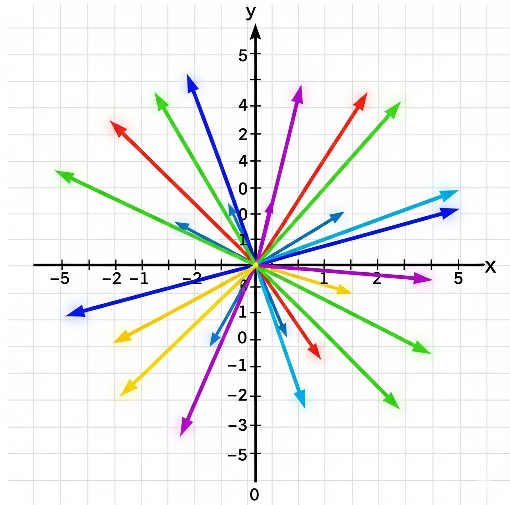
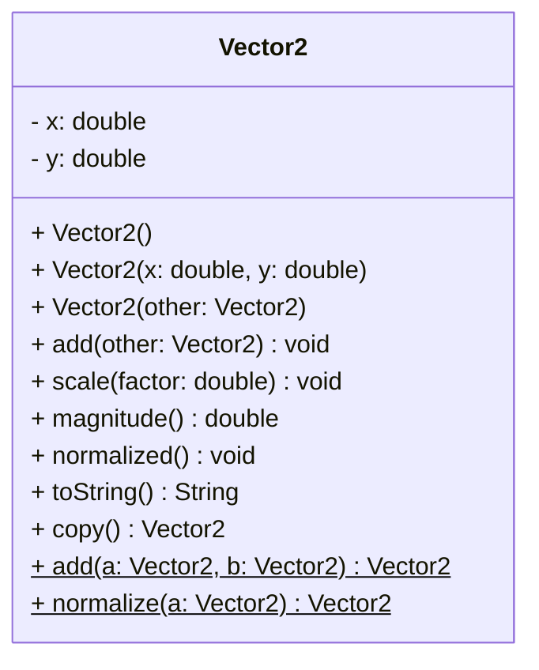

# Vector (2D) Exercise

Implement a 2D `Vector2` class that models a vector in the plane.\
The class will have instance fields, multiple constructors, and static utility methods.\
Write a small `main` program to demonstrate and test the features.

**Requirements:**

_Instance fields:_
- `x: double`
- `y: double`

_Constructors:_
  - `Vector2()` → initializes to (0, 0)
  - `Vector2(double x, double y)`
  - `Vector2(Vector2 other)` (copy constructor, this will make a copy of the argument vector)
  
Below are the instance methods. Some methods are mutating, with a return type of `void`.

_Instance methods:_
  - `add(Vector2 other): void` (add the `other` vector to `this` vector)
  - `scale(double factor): void` (multiply the vector by the factor)
  - `magnitude(): double` (the length of the vector)
  - `normalized(): void` (length 1; if zero vector, do nothing)
  - `toString(): String` → `(x, y)` with 2 decimals
  - `copy(): Vector2` (make a copy of the vector)

And then some static utility methods, which will sometimes make things simpler.

_Static utility methods:_
  - `add(Vector2 a, Vector2 b) : Vector2`
  - `normalize(Vector2 a) : Vector2`