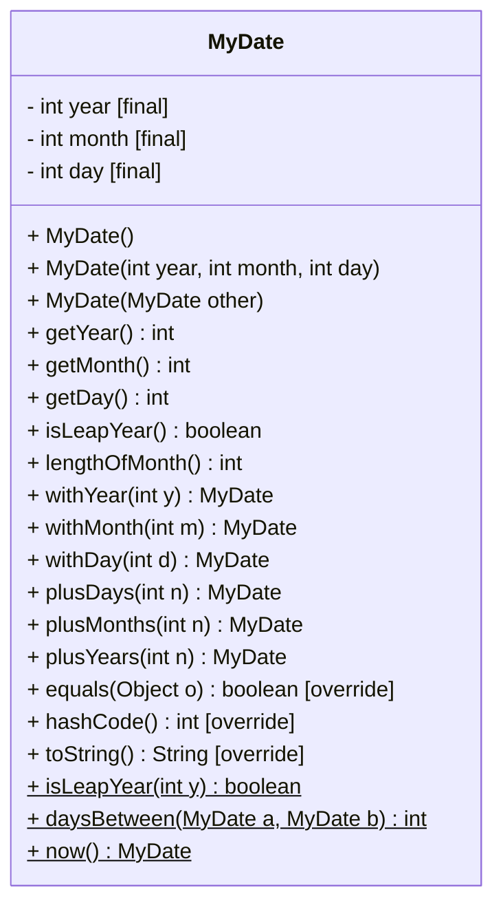

# MyDate Exercise (Simplified Date Class)

Implement a simplified immutable `MyDate` class to represent a calendar date.\
Provide multiple constructors, common instance methods, and a few static utility methods. Write a small `main` program to interactively create and manipulate dates and to validate your implementation.

Below is a class diagram for the `MyDate` class.

Some methods, e.g. `plus...()` are complicated, you may want to save these for the end.

No validation is expected, as you have not yet learned about exceptions. Just assume the user will input valid values.

**Fields**

Make these final, i.e. immutable:
- `year: int`
- `month: int` (1–12)
- `day: int` (1–28/29/30/31 depending on month)

**Constructors**

- `MyDate()` → today (use system date)
- `MyDate(int year, int month, int day)` → validate inputs
- `MyDate(MyDate other)` → copy constructor

**Instance methods**

You can see a couple of instance methods.

First, you have the accessors for the fields: `getYear()`, `getMonth()`, `getDay()`.

Then the `isLeapYear()` method. It should return `true` if the year of the instance is a leap year, and `false` otherwise.

The `lengthOfMonth()` method should return the number of days in the month of the instance.

And the `withYear(int y)`, `withMonth(int m)`, `withDay(int d)` methods should return a new `MyDate` instance with the year, month, or day changed to the value of the parameter. This is a "copy-with-modifications" method. Commonly the methods start with `with` as they are not mutating the instance, but rather returning a new instance.

Three `plus...` methods. They should return a new `MyDate` instance with the year, month, or day increased as necessary by the value of the parameter. This is a copy-with-modifications method.

And finally override the three methods from Object: `equals(Object o)`, `hashCode()`, `toString()`.

**Static utility methods**

- `now(): MyDate` → create a new MyDate instance with today's date
- `isLeapYear(int y): boolean` → return `true` if the year is a leap year, and `false` otherwise.
- `of(int y, int m, int d): MyDate` → create a new MyDate instance with the year, month, and day of the parameters. We call this a factory method.

