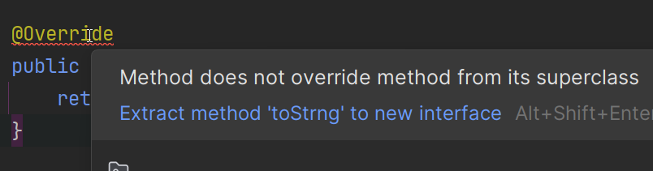

# @override

You may have noticed on the previous pages, that each of the three methods, `equals`, `toString`, and `hashCode`, was _annotated_ with `@override`.\
While it is not strictly necessary to add this annotation, it is considered good practice to do so.

The Java compiler will use this information, to check that you are actually overriding a method from a superclass, in this case from `Object`.\
If you accidentally make a mistake, for example by misspelling the method name, the compiler will give you an error.

Consider the following example, where we try to override the `toString` method, but we accidentally misspell it as `toStrng`:

```java
@Override
public String toStrng() {
    return "MyObject";
}
```

And the compiler will give you an error like this:



If you remove the `@override` annotation, the compiler will not give you an error, but your method will not override the `toString` method from `Object`, and it will not be called when you try to print the object.