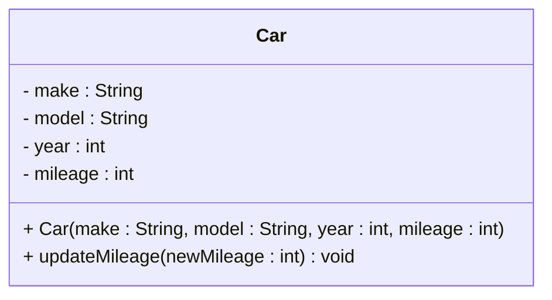

# Exercise: Implement the Car class and override Object methods

Implement a `Car` (diagram below) class in Java with a few private field variables and a constructor that sets those fields.\
Also override `toString()`, `equals(Object)` and `hashCode()` so `Car` instances can be compared by content and printed nicely.

- Overrides required:
  - `public String toString()` — return a readable representation of the car.
  - `public boolean equals(Object obj)` — compare relevant fields for logical equality.
  - `public int hashCode()` — return a hash consistent with `equals`.

UML class diagram (Mermaid) — note: no methods listed except the constructor as requested:

## Exercise - test

Test the implemention from the above exercise, with a main method.

- Create two `Car` objects with identical field values and verify `equals` returns `true`.
- Verify that the hash codes of the two `Car` objects are identical.
- Print a `Car` instance to verify `toString()` output.
- Create a third `Car` object with different field values and verify `equals` returns `false` when compared to the first two.
- Verify that the hash code of the third `Car` object is different from the first two.