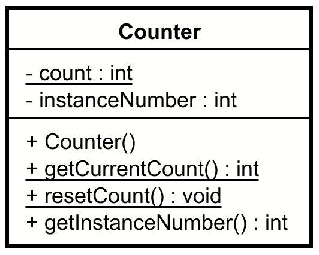

# Static Methods and Fields Exercises

## Exercise 1 - Counter Class

Write a program that implements a Counter class with static methods and fields.\
The class should track the total number of Counter objects created and provide static methods to access this information.\
In the constructor, increment the static `count`, and assign it to the instance field variable `instanceNumber`.\
This way, we track the total number of instances of Counter, and each Counter gets its own id, as the instance`Number`.\
Print out relevant information along the way.

**Requirements:**
- A static field to count total instances created
- A static method to get the current count
- A static method to reset the counter
- Constructor that increments the static counter
- Instance method to get the instance number

**Example Output:**

```console
Counter 1 created
Counter 2 created
Counter 3 created
Total counters: 3
Instance 2 of 3
Reset counter
Total counters: 0
```

Here is the class diagram:



## Exercise 2 - Math Utility Class

Implement a MathUtils class with static methods for common mathematical operations. The class should not be instantiable.

**Requirements:**
- Static method to calculate factorial
- Static method to calculate x^y
- Static method to floor a double to the nearest integer (meaning rounding down to nearest integer. Without using Math.floor)
- Static method to ceil a double to the nearest integer (meaning rounding up to nearest integer. Without using Math.ceil)
- Private constructor to prevent instantiation
