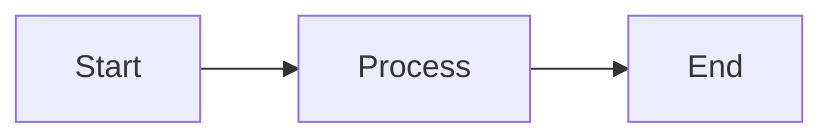

# Markdown Syntax Test Suite

This file exercises standard Markdig advanced syntax and Codelabs-specific custom features. Each section is labeled so you can scroll and verify rendering independently.

---

## 1. Headings

# H1 — Main title

## H2 — Section heading

### H3 — Subsection

#### H4 — Sub-subsection

##### H5 — Fifth level

###### H6 — Sixth level

## Heading with **bold** and *italic*

### Duplicate Heading

Some content under the first duplicate.

### Duplicate Heading

Some content under the second duplicate (tests auto-identifiers).

---

## 2. Paragraphs and Line Breaks

This is a normal paragraph with enough text to wrap. It should render as a single block.

This line is on its own row
And this line follows without a trailing backslash.
Expected: both lines merge into one paragraph (soft breaks are not enabled).

Line one with trailing backslash\
Line two after hard break.
Expected: two lines within the same paragraph, separated by `<br>`.

Paragraph one with blank line separation.

Paragraph two after a blank line.

---

## 3. Emphasis

**Bold text** and *italic text* and ***bold italic***.

~~Strikethrough text~~ (emphasis extras).

==Highlighted text== (emphasis extras / mark).

Superscript: X^2^ + Y^3^.

Subscript: H~2~O and CO~2~.

Escaped asterisks: \*not bold\* and \_not italic\_.

---

## 4. Links

Inline link to [same-page anchor](#1-headings).

Inline link to [external site](https://example.com).

Link with [title attribute](https://example.com "Example Title").

Reference-style link to [Markdig on GitHub][markdig-ref].

Autolink angle brackets: <https://example.com> and <user@example.com>.

Bare URL in prose: https://example.com (auto-links extension).

Empty text link: [](https://example.com).

Expected for external links: `target="_blank"`, `rel="noopener noreferrer"`, and trailing ↗ icon.

[markdig-ref]: https://github.com/xoofx/markdig "Markdig repository"

---

## 5. Images

Relative image (should get GitHub base URL prefix):


Absolute image (URL unchanged):


Figure block (Markdig figures extension):

^^^
This is figure body content with **formatting**.
^^^ This is a *figure caption*

---

## 6. Lists

### Unordered lists

- Dash item one
- Dash item two
  - Nested dash A
  - Nested dash B
    - Third level

* Asterisk item one
* Asterisk item two

+ Plus item one
+ Plus item two

### Ordered lists

1. First ordered item
2. Second ordered item
   1. Nested ordered A
   2. Nested ordered B
3. Third ordered item

### Task lists

- [ ] Unchecked task
- [x] Checked task
- [ ] Task with **bold** and `code`

### List with inline formatting

- Item with **bold**, *italic*, and [a link](https://example.com)
- Item with inline `code_snippet()`

List immediately after this paragraph (no blank line):
- Tight list item one
- Tight list item two

---

## 7. Blockquotes

> Single-line blockquote.

> Multi-line blockquote line one.
> Multi-line blockquote line two.

> Blockquote with a list:
> - Quoted item A
> - Quoted item B
>
> And `inline code` inside the quote.

>> Nested blockquote level two.
>>
>> > Nested blockquote level three.

---

## 8. Horizontal Rules

Rule with dashes:

---

Rule with asterisks:

***

Rule with underscores:

___

Consecutive rules (no blank line between):

---
---

---

## 9. Inline Code

Simple: `var x = 1;`

With underscores: `code_with_underscores`

With dots: `obj.method.call()`

Backtick inside double backticks: `` use `var` here ``

---

## 10. Fenced Code Blocks

### Plain fenced block (no language)

```
plain text
no syntax highlighting expected
```

### Indented code block (4 spaces)

    indented line one
    indented line two

### C#

```csharp
public class Greeter
{
    public string Greet(string name) => $"Hello, {name}!";
}
```

### Java

```java
public class Hello {
    public static void main(String[] args) {
        System.out.println("Hello");
    }
}
```

### Python

```python
def greet(name: str) -> str:
    return f"Hello, {name}!"
```

### HTML

```html
<p><strong>Hello</strong> world</p>
```

### JSON

```json
{
  "name": "test",
  "value": 42
}
```

### Bash

```bash
echo "Hello World"
ls -la
```

### Line highlighting (custom `{n}` syntax on fence)

Expected: lines 3, 7, 8, and 9 highlighted; line numbers enabled.

```java{3,7-9}
public class Example {
    private int value;

    public Example(int value) {
        this.value = value;
    }

    public int getValue() {
        return value;
    }

    public void setValue(int value) {
        this.value = value;
    }
}
```

### Long block (line numbers)

```csharp
// Line 1
// Line 2
// Line 3
// Line 4
// Line 5
// Line 6
// Line 7
// Line 8
// Line 9
// Line 10
```

---

## 11. Tables

### Pipe table with alignment

| Left aligned | Center aligned | Right aligned |
|:-------------|:--------------:|--------------:|
| cell A1      | cell B1        | cell C1       |
| cell A2      | cell B2        | cell C2       |

### Pipe table with inline formatting

| Column | Example |
|--------|---------|
| Code   | `Console.WriteLine()` |
| Link   | [Example](https://example.com) |
| Bold   | **important** |

### Grid table (Markdig grid tables)

+----------------+----------------+
| Fruit          | Price          |
+================+================+
| Bananas        | $1.34          |
+----------------+----------------+
| Oranges        | $2.10          |
| Apples         | $2.99          |
+----------------+----------------+

---

## 12. Footnotes

Text with a footnote reference[^fn1]. And another longer footnote[^fn-long].

This paragraph references the first footnote again[^fn1].

[^fn1]: Footnote body with **bold** and *italic* formatting.

[^fn-long]: A footnote with multiple blocks.

    Subsequent paragraphs belong to the same footnote when indented.

    > A blockquote inside a footnote.

        { some.code }

---

## 13. Definition Lists

Term One
: Definition for term one.

Term Two
: Definition with a nested list:
  - Nested item A
  - Nested item B

API
: Application Programming Interface — a set of rules for building software.

---

## 14. Abbreviations

*[HTML]: Hyper Text Markup Language
*[CSS]: Cascading Style Sheets

The HTML spec is large. CSS controls presentation.

---

## 15. Alert Blocks

> [!NOTE]
> Highlights information users should take into account, even when skimming.

> [!TIP]
> Optional information to help a user be more successful.

> [!IMPORTANT]
> Crucial information necessary for users to succeed.

> [!WARNING]
> Critical content demanding immediate user attention due to potential risks.

> [!CAUTION]
> Negative potential consequences of an action.

---

## 16. Custom Containers

::: info
This is an info custom container.
:::

::: warning
This is a warning custom container with **bold** text.
:::

---

## 17. Mathematics

Inline math: $E = mc^2$ and $a^2 + b^2 = c^2$.

Block math:

$$
\int_0^1 x^2 \, dx = \frac{1}{3}
$$

---

## 18. Diagrams



---

## 19. Footers

^^ This is a footer block.
^^ It spans multiple lines.

---

## 20. Citations

As Einstein reportedly said: ""Imagination is more important than knowledge.""

This uses Markdig's cite extension with double-quote emphasis syntax.

---

## 21. HTML and Custom Codelabs Syntax

### Keyboard / button (`kbd`)

Click <kbd>OK</kbd> to confirm, or press <kbd>Esc</kbd> to cancel.

### Circle step numbers (`((n))`)

Inline: complete step ((1)), then step ((2)), and step ((10)).

Step list with line breaks:

((1)) Open the application\
((2)) Select **File → New**\
((3)) Enter a project name\
((4)) Click <kbd>OK</kbd>

### Hint block (collapsible details)

<hint title="Hint">

This hint contains nested markdown:

- Hint list item one
- Hint list item two

```java
System.out.println("Code inside a hint");
```

</hint>

<hint title="Solution">

The answer is **42**.

</hint>


---

## 22. Edge Cases and Stress Tests

### Special characters in prose

Less-than: 5 < 10. Greater-than: 10 > 5. Ampersand: Tom & Jerry.

Same characters in code: `if (a < b && b > 0) { }`

### Unicode

Emoji in text: 🎉 ✅ 🚀

CJK characters: 你好世界

Accented letters: café, naïve, Zürich, æøå

### Anchor link to section

[jump to Headings section](#1-headings)

### Code block adjacent to list (no blank line)

- List item ending with code:
```text
code block immediately after list item
```

### Very long unbroken word

supercalifragilisticexpialidocious

### HTML comment

<!-- This comment should not appear in rendered output -->

### Mixed emphasis edge cases

**Bold with `code` inside** and *italic with [link](https://example.com) inside*.

### Escaped characters in code vs text

In prose: \*asterisk\* \_underscore\_ \`backtick\`

In code: `\* \_ \``

---

## Quick Reference Index

| # | Section | Key syntax |
|---|---------|------------|
| 1 | Headings | `#` through `######` |
| 2 | Paragraphs | `\` hard break |
| 3 | Emphasis | `**`, `*`, `~~`, `==`, `^`, `~` |
| 4 | Links | `[text](url)`, autolinks |
| 5 | Images | ``, `^^^` figures |
| 6 | Lists | `-`, `1.`, `- [ ]` tasks |
| 7 | Blockquotes | `>` |
| 8 | HR | `---`, `***`, `___` |
| 9 | Inline code | `` ` `` |
| 10 | Code blocks | ` ```lang `, ` ```java{3} ` |
| 11 | Tables | pipe and grid |
| 12 | Footnotes | `[^1]` |
| 13 | Definition lists | `Term\n: Definition` |
| 14 | Abbreviations | `*[ABBR]: expansion` |
| 15 | Alerts | `> [!NOTE]` |
| 16 | Containers | `::: info` |
| 17 | Math | `$...$`, `$$...$$` |
| 18 | Diagrams | ` ```mermaid ` |
| 19 | Footers | `^^` |
| 20 | Citations | `""cite""` |
| 21 | Custom | `<kbd>`, `((n))`, `<hint>`, `<video>` |
| 22 | Edge cases | unicode, anchors, comments |
