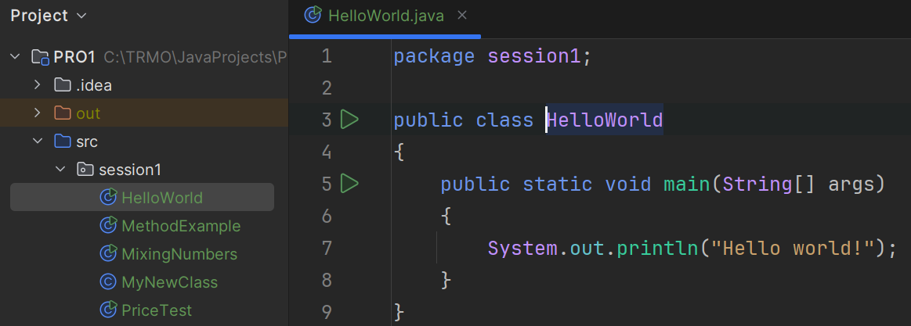

# The Java Compiler and JVM

This article will provide a simple explanation of the Java Compiler and the Java Virtual Machine (JVM), two essential components of the Java programming language.

## What is the Java Compiler?

The Java Compiler is a tool that translates the code you write in the Java programming language into a format that the computer can understand. When you write Java code, you save it in files with the extension `.java`. These files contain human-readable instructions written in Java.

Your Java files are the ones you create in IntelliJ, like here:

The Java Compiler takes these `.java` files and converts them into something called "bytecode." Bytecode is a set of instructions that the computer can process, but it is not specific to any one computer or operating system. Instead, bytecode is designed to be understood by the Java Virtual Machine (JVM).

## What is the JVM?

The JVM, or Java Virtual Machine, is a program that runs on your computer and understands bytecode. It acts as a translator between the bytecode and your computer's hardware. The JVM takes the bytecode generated by the Java Compiler and converts it into machine code, which is specific to your computer's operating system and hardware.

This process allows Java programs to run on any computer that has a JVM installed, regardless of the operating system. This is why Java is known as a "platform-independent" language.

## How Do They Work Together?

1. **Write Code**: You write your Java program in a `.java` file.
2. **Compile Code**: The Java Compiler converts your `.java` file into a `.class` file containing bytecode.
3. **Run Code**: The JVM reads the bytecode in the `.class` file and executes it on your computer.

## Why Are They Important?

- **Java Compiler**: Ensures your code is free of syntax errors and prepares it for execution.
- **JVM**: Makes Java programs portable and able to run on different types of computers.

Together, the Java Compiler and JVM make Java a powerful and versatile programming language.
