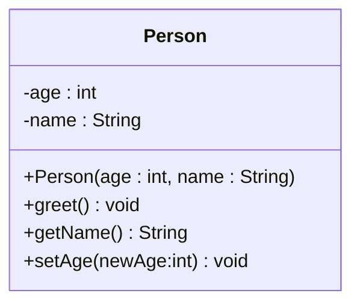

# Introduction

You are being introduced to UML (Unified Modeling Language), throughout the course, and so, various parts have popped up at various times throughout the course.\
When you learned about classes, you saw UML for that. Then you learned about relationships, and saw UML for that. You learned about inheritance, and saw UML for that.

So, the UML teachings were spread out, over many learning paths.

This article aims to put it all in one place.

I also, eventually, plan on having small videos accompanying each page, explaining how to do that particular concept in Astah.

**Note**

Some diagram examples in this article are created in Astah, and screenshotted. Other examples are rendered directly using Mermaid UML. This is only to say, there are small differences in how the diagrams might look. 

Here is a diagram from Astah:

And here is the same diagram using Mermaid:

