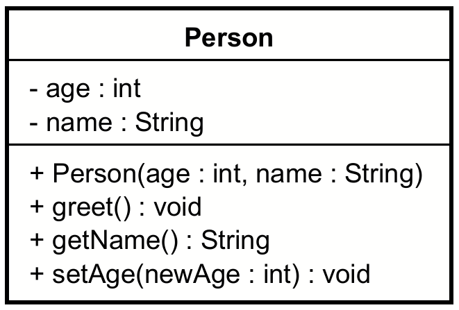
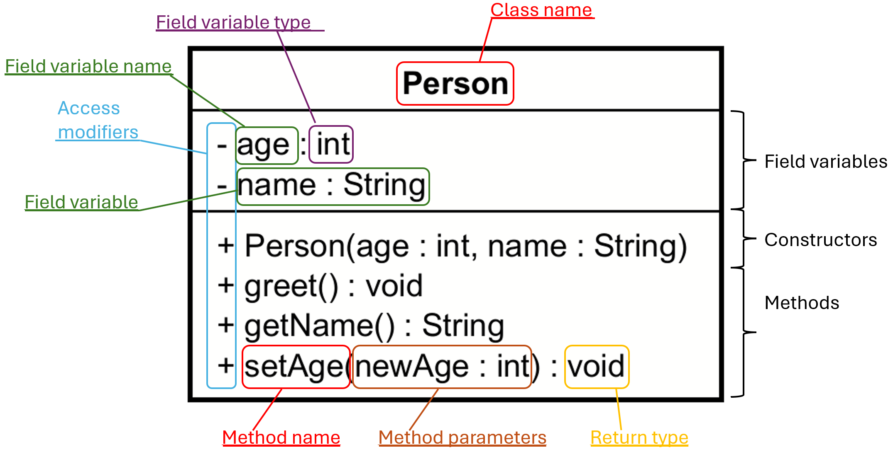

# Classes in UML

In UML a class is represented as a rectangle divided into three compartments:
1. The top compartment contains the class name.
2. The middle compartment contains the attributes (fields) of the class.
3. The bottom compartment contains the methods (operations) of the class.

For example, a `Person` class might be represented as follows:

We will dig into what the various things mean, by starting with this overview here:

## Creating a new class in Astah

video here..