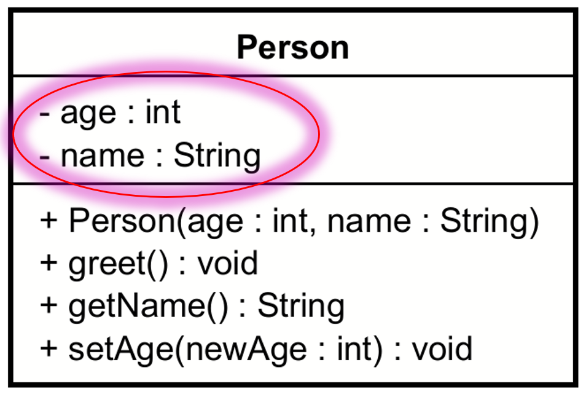

# Field variables

In the middle compartment of the class box, we have the attributes (fields) of the class. These represent the data that the class will hold.

Notice they are sort of defined opposite what we do in Java: first the field name, then colon, then the field type. For example: `name: String` and `age: int`.

## Adding field variables to a class in Astah

video here..
