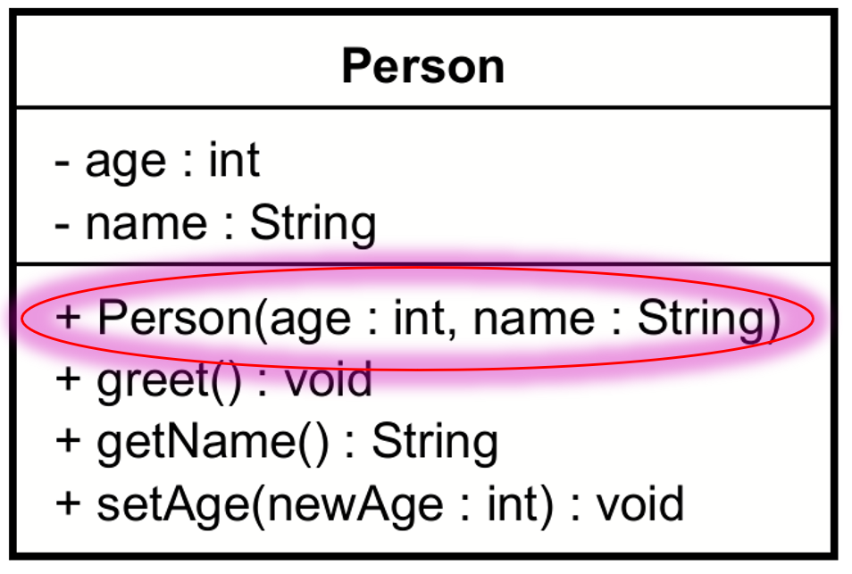

# Constructors

The bottom compartment holds the methods, and constructors are a special kind of methods, so they belong here too.

Notice the constructor in the below diagram is public (+), has the same name as the class, with the same casing. I.e. where Java methods are camelCase, constructors (and classes) are PascalCase.

The constructor does not have a return type, not even void. Compare the constructor with the other methods in the class, and observe the return types are at the end of each method.

## Adding a constructor to a class in Astah

video here...