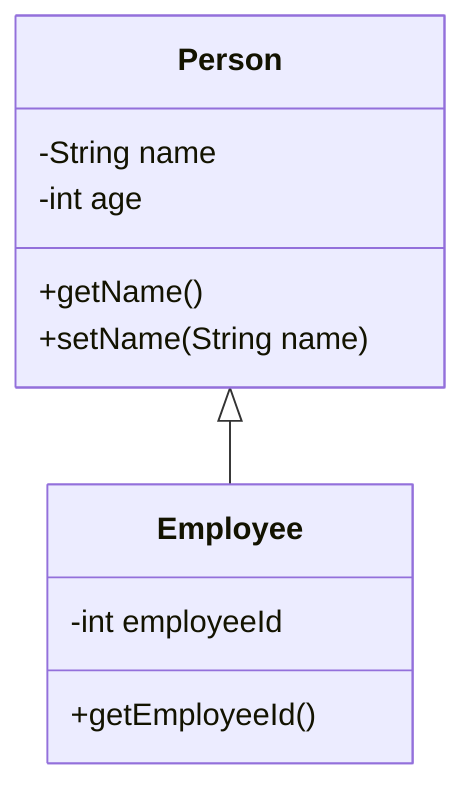

# Static methods and field variables

Static methods and field variables are underlined in UML class diagrams.

Here is an example:

+---------------------------------------+\
|               MathUtils               |\
+---------------------------------------+\
| <u>+ calculateSum(a: int, b: int): int</u>   |\
+---------------------------------------+

## Marking something static in Astah

video here..

