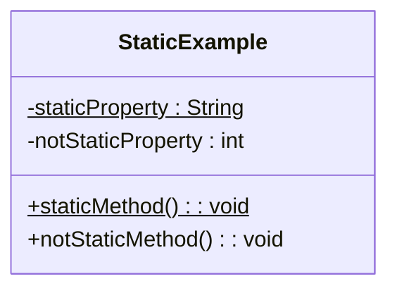

# Static methods and field variables

Static methods and field variables are underlined in UML class diagrams.

Here is an example:

```mermaid
classDiagram
    class StaticExample {
        <static> -staticProperty : String$
        -notStaticProperty : int
        <static> +staticMethod() : void$
        +notStaticMethod() : void
    }
```

## Marking something static in Astah

video here..

