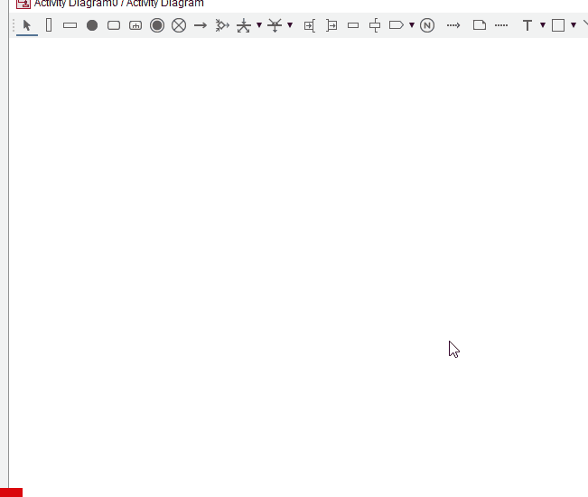

# Adding swimlanes

I you plan on using swimlanes, you should add them as the first thing. You _can_ do it later, but it's easier to do it early.

They are in the top toolbar, select the icon, add as many as you need, update the names as needed.

You can drag a vertical edge to resize the swimlane.

