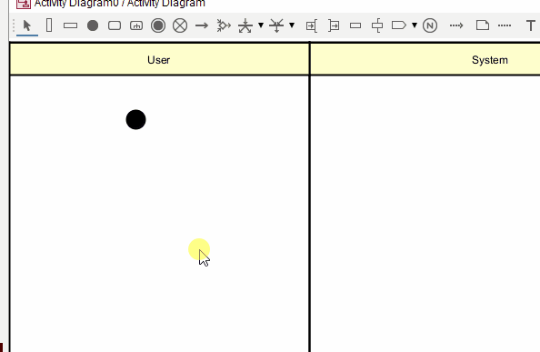

# The activity node

This is the default node, meaning if you double click anywhere on the diagram, you will get an activity node.

Alternatively, select it from the top toolbar, then click on the diagram.

