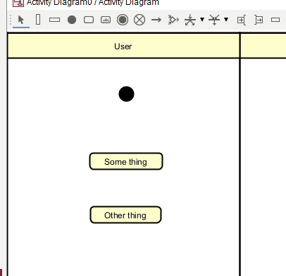
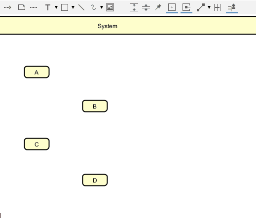

# Transitions

These are the arrows that connect the nodes.

The transition arrow is available in the top toolbar. 

Or, you can make sure nothing is selected, by clicking on empty space in the diagram, then mouse over a node (activity, start, decision, etc.) and the arrow will be available.

Observe:

## Transition arrow shape

The transition lines come in different "shapes":
- straight line
- angled line
- curved line
- multi-curved

I recommend always, if possible, to use the angled line. We want the lines to allign horizontally and vertically. This will make the prettiest layout.

