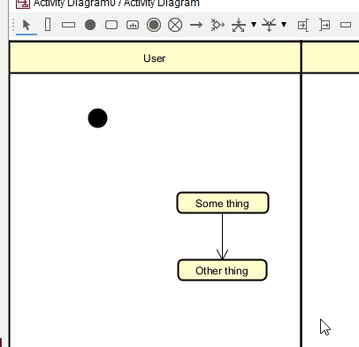
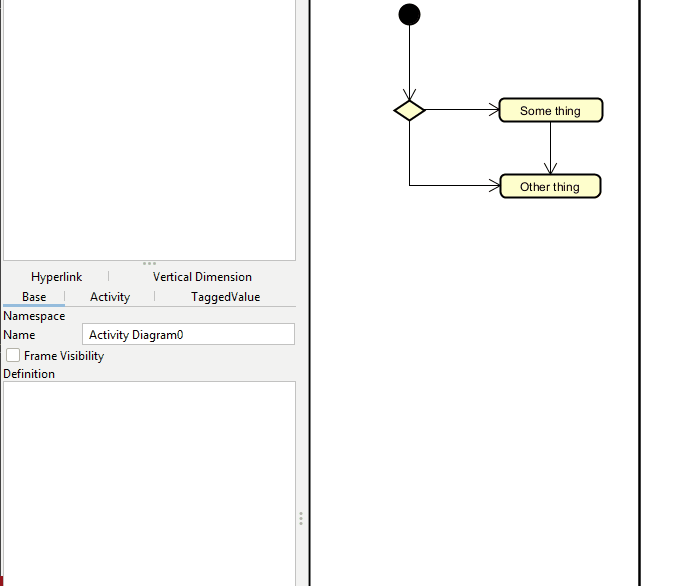

# Decision node

These are available in the top toolbar. Select the icon, click on the diagram, and you will get a decision node.

Then you can drag arrows to and from the decision node.

## Adding guards

Guards are added by clicking on a transition arrow, and on the left side, you can then input the guard expression.

