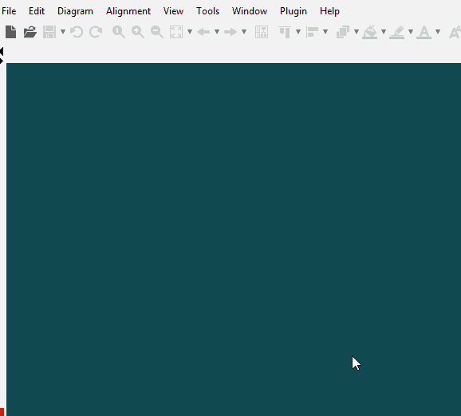
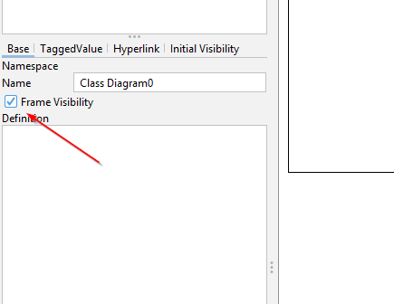

# Creating the diagram

In Astah you will be using a _class diagram_ to create the domain model. We will then, on the next page, hide certain things, like access modifiers and types. These details are not relevant for the domain model, and should not be shown. In Astah they can be hidden.

Here is how you create a class diagram in Astah:

And as always, I like to remove the outer frame:

Now you have a blank diagram.