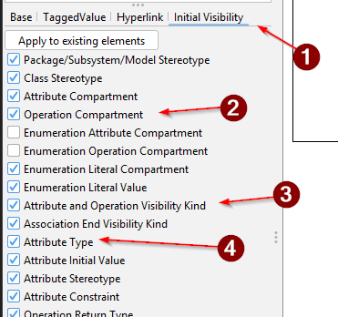

# Visibility of data

You have just created a class diagram. This type of diagram contains information, which we are not interested in for the domain model, like access modifiers and types. These details are not relevant for the domain model, and should not be shown. In Astah they can be hidden.

We do that in the left side panel under "Initial Visibility":

First select the tab.

Then check _off_ the following three settings:

- Operation Compartment. This is the bottom compartment of the class diagram, where you can see the methods. We don't need these.
- Attribute and Operation Visibility Kind. This is the kind of visibility, i.e. access modifiers, like public, private, protected, etc. We don't need these.
- Attribute Type. This is the type of the attribute, i.e. String, int, double, etc. We don't need these.

## But, mr Teacher Troels sir, I forgot!

If you already started on the diagram, added entities and such, and remembered you had to hide these things, you can do it later.

In the image above, notice there is a button with "Apply to existing elements". Click that, and all your existing elements will have the visibility hidden.
