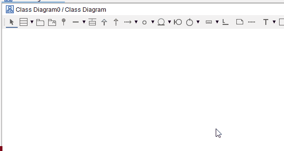

# Adding entities to the diagram

The entity (or class) is the default element in a class diagram in Astah. If you double click anywhere on empty space, you will get a new entity.

Alternatively, select the "Class" tool from the toolbar, and click anywhere on the diagram.

