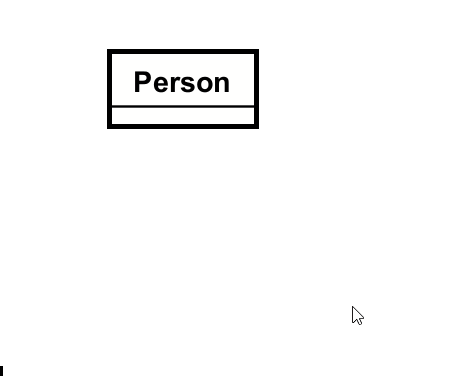
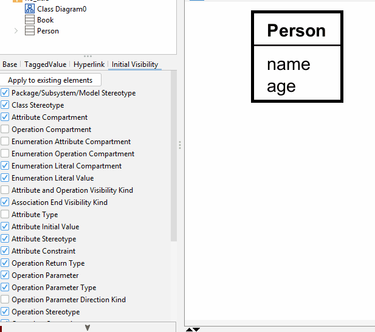
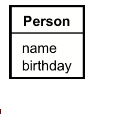

# Attributes in Domain Models

We have two ways to add attributes. The first is the easier, I think.

## By mouse over
Adding attributes is done either by having nothing selected, and then mouse over a class, and you will see a little icon.

When typing in the name of the entity, you will actually see the extra data, that we hid in the previous page: visibility and type. Just ignore these, they will disappear when pressing enter.

When done typing, you can press enter to finish, and then enter again to add a new attribute.

## By left side panel
Alternatively, attributes can be added in the left side panel:

## Normal attributes
The above two approaches add "normal" attributes. But there are also derived and multivalued attributes, explained below.

## Derived attributes

You just put a "/" in front of the attribute name. Like so:

## Multivalued attributes

Here, you put the multiplicity constraint after the name. Directly after the name. Like so:

