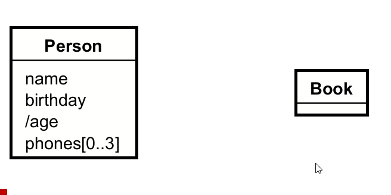
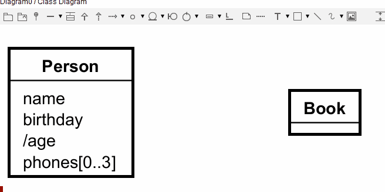
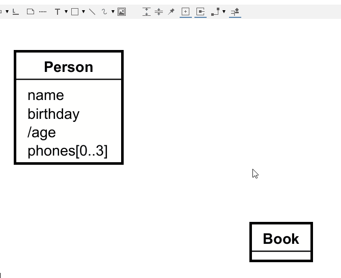

# Adding relationships

These are the lines that connect the entities.

Again, two approaches: mouse over, or tool bar.  

## Mouse over

Make sure nothing is selected, and then mouse over an entity, and you will see a little icon.

The direction you drag the line is somewhat important. It will determine the direction of the arrow, when you name the relationship. This can, however, be reversed later.

## Tool bar

Or select the "Association" tool from the toolbar, click on entity, then the other.

## Line types

There are several types of lines, this is about the shape of them. You should stick to the angled lines. This will make your lines horizontal and vertical, with 90 degree angles.

Don't use the curved lines. 

Don't use straight lines.

There _may_ be _very_ rare occasions, where you need to use a different line type. But please, do try to stick to the angled lines. They are just prettier, and generally make your diagram more readable.

