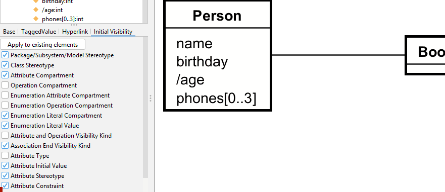
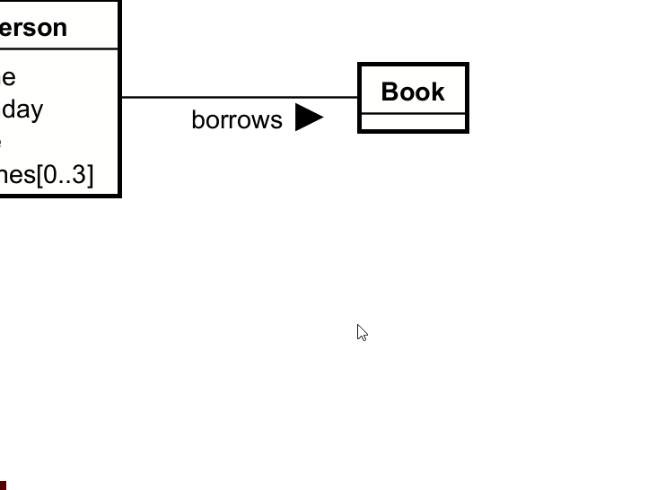

# Naming a relationship

This is done in the left side panel.

First, select the relationship line.

Then find the "Name" field in the left side panel.

Notice that the arrow on the name points in the direction your dragged the line. You selected one entity first, then the other. Had you selected the latter entity first, the arrow would point in the opposite direction. It can be reversed, see below.

## Reverse direction

To reverse the direction, you click on the relationship line, then right click, and select "Reverse direction".

