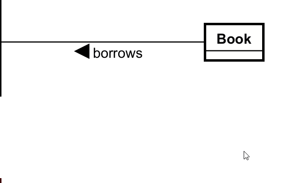
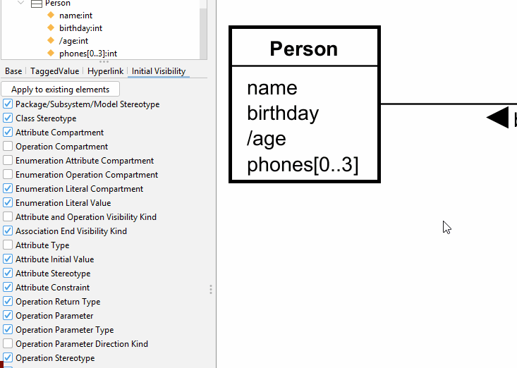

# Adding multiplicities

Again, we have two ways to add multiplicities. The first is the easier, I think. You can mouse over, or you can use the left side menu.

## By mouse over

Make sure nothing is selected, by clicking on the empty space. Then mouse over a relationship line, and you will see a little "*" icon.\
Clicking this icon will open a small menu with options.\
After selecting an option, you can still edit the multiplicity and type something else, if you want.

You can delete the multiplicity by just selecting it, and then pressing the <kbd>Delete</kbd> key.

## From the menu

Or the left side menu, it's a bith more finicky, I think. 

You to select the relationship line, and then the tab for "Association End A" or "Association End B". The "A" side was where you dragged the line _from_.

