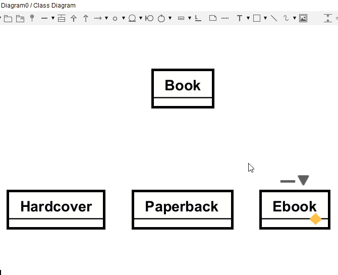

# Drawing inheritance in Domain Models

You select the inheritance arrow from the toolbar. Then drag from the child to the parent.

If you have multiple entities inheriting from the same parent, you drag from a child, to the _arrowhead_ of the parent. This _should_ allign the lines correctly.

> Make sure to align the lines correctly. If you have multiple inheritance lines, they should form an upside down fork.

The parent is above the children. This is convention, you should follow it. There are rare occasions, where your diagram will become messy, and you _may_ divert from convention, but please, do try to follow it.

Notice how I can drag the lines.

Notice how, when all three inheritance lines are done, and _if added correctly_, they will sort of merge. When dragging one down vertically, the other two will follow, to keep the inverted fork shape.