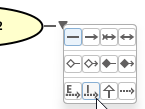
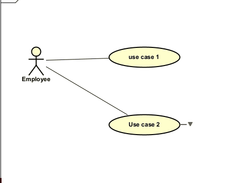

# Include and extend arrows

These lines are drawn from one use case to another. Make sure nothing is selected, mouse over a use case, and you will see the little "draw line" icon, with the expand-menu-arrow.

You are looking for the dotted lines with "E" or "I" on them.

