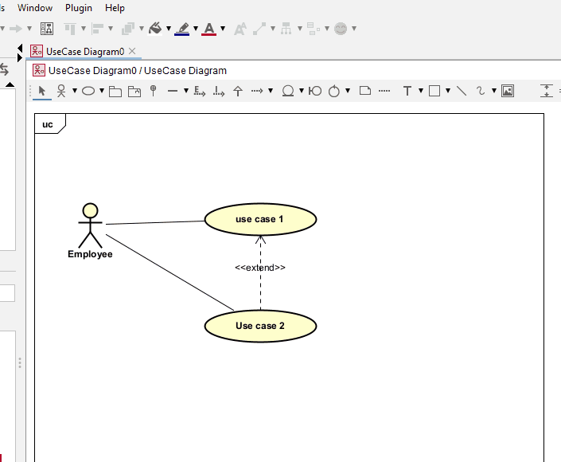
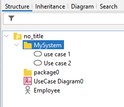

# Drawing a box

Formally, you are supposed to draw a box around the use cases, and name the box after your system.

I think using a package is the easiest approach. It requires:

- Add a package to your diagram
- Resize the package
- Add a name to the package
- Move the name to the top left of the package instead of inside the package
- Drag use cases onto the package
- Clean up

You may notice in the structure overview now, how the use cases are nested inside the package.

When you now add further use cases, make sure to click inside the package. Expand the package as needed.