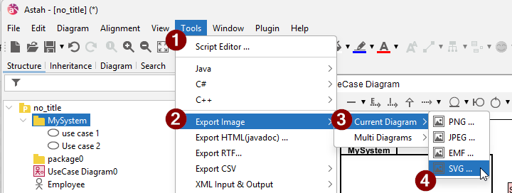

# Exporting the diagram

Generally, you want your diagrams to be vector format, .svg is good.
This means that you can zoom in and out, and the lines will not become fuzzy.

If you export large diagrams as png, or even worse, take a screenshot, they will often become blurry and unreadable.

> .svg is life. Do it.

You export a diagram from Astah here:

