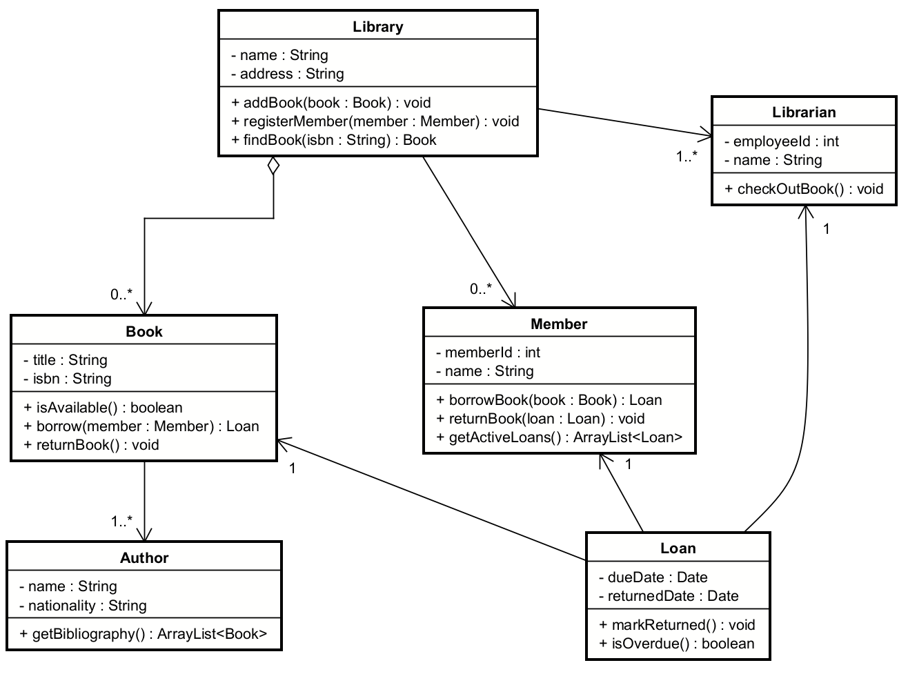
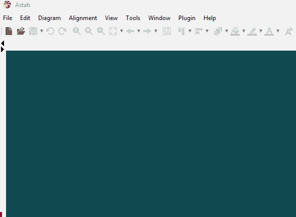

# The Class Diagram

The class diagram is a schematic, or blueprint, of a software system. 

It shows various classes, with their methods, attributes, etc, and the relationships between them.

Below is an example:

## Creating a class diagram in Astah

