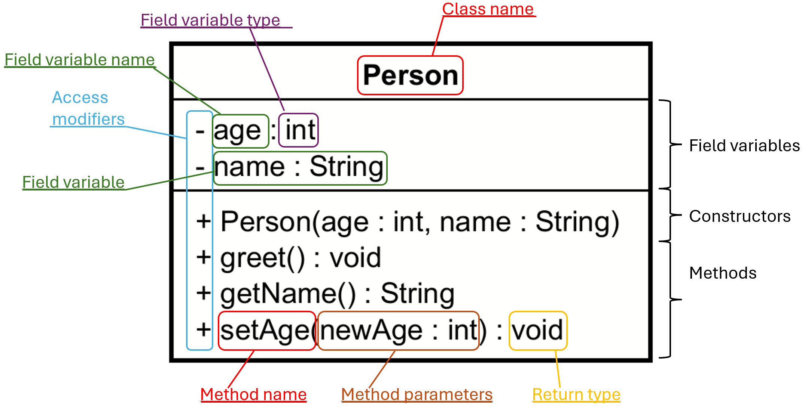

# Classes in UML

In UML a class is represented as a rectangle divided into three compartments:
1. The top compartment contains the class name.
2. The middle compartment contains the attributes (fields) of the class.
3. The bottom compartment contains the methods (operations) of the class.

For example, a `Person` class might be represented as follows:

We will dig into what the various things mean, by starting with this overview here:

## Creating a new class in Astah

video here..

script
* I can create it by double clicking.
* Or by selecting the "Class" icon.
* It now appears to the left.
* If I remove the class from the diagram, it is still in the project.
* If I try to create a class again, with the same name, I get an error.
* Instead, I can drag it out, from the project, to the diagram.
* I can remove it from the project, and it will be completely gone.