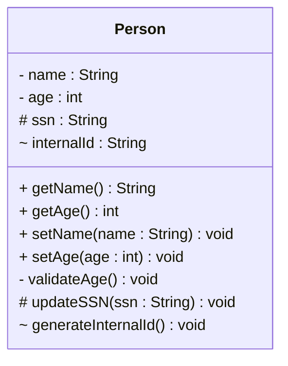

# Access modifiers

In UML, access modifiers are used to specify the visibility of class members (attributes and methods). The most common access modifiers are:

1. **Public (+)**: The member is accessible from outside the class
2. **Private (-)**: The member is only accessible within the class
3. **Protected (#)**: The member is accessible within the class and its subclasses (you will learn about protected later in the course)
4. **Package protected (~)**: The member is accessible within the package 

These modifiers are represented in the class diagram as prefixes to the member names. 

In this example, the `name` and `age` attributes are private (indicated by the `-` prefix), while the `getName()` and `getAge()` methods are public (indicated by the `+` prefix).
The `ssn` attribute is protected (indicated by the `#` prefix), and the `internalId` attribute is package protected (indicated by the `~` prefix).




It may be a bit difficult distinguishing the "-" from the "~" in the diagram.

The corresponding Java code:

```java
public class Person {
    // Private fields
    private String name;
    private int age;
    
    // Protected field
    protected String ssn;
    
    // Package protected field (no modifier = package protected)
    String internalId;

    // Public methods
    public String getName() {
        return name;
    }

    public int getAge() {
        return age;
    }
    
    public void setName(String name) {
        this.name = name;
    }
    
    public void setAge(int age) {
        this.age = age;
    }
    
    // Private method
    private void validateAge() {
        // ...
    }
    
    // Protected method
    protected void updateSSN(String ssn) {
        this.ssn = ssn;
    }
    
    // Package protected method (no modifier = package protected)
    void generateInternalId() {
        this.internalId = "ID" + System.urrentTimeMilli();
    }
}
```

Notice all four access modifiers in the above snippet: private (-), public (+), protected (#), and package protected (~).

## Access modifiers in Astah

Video here..