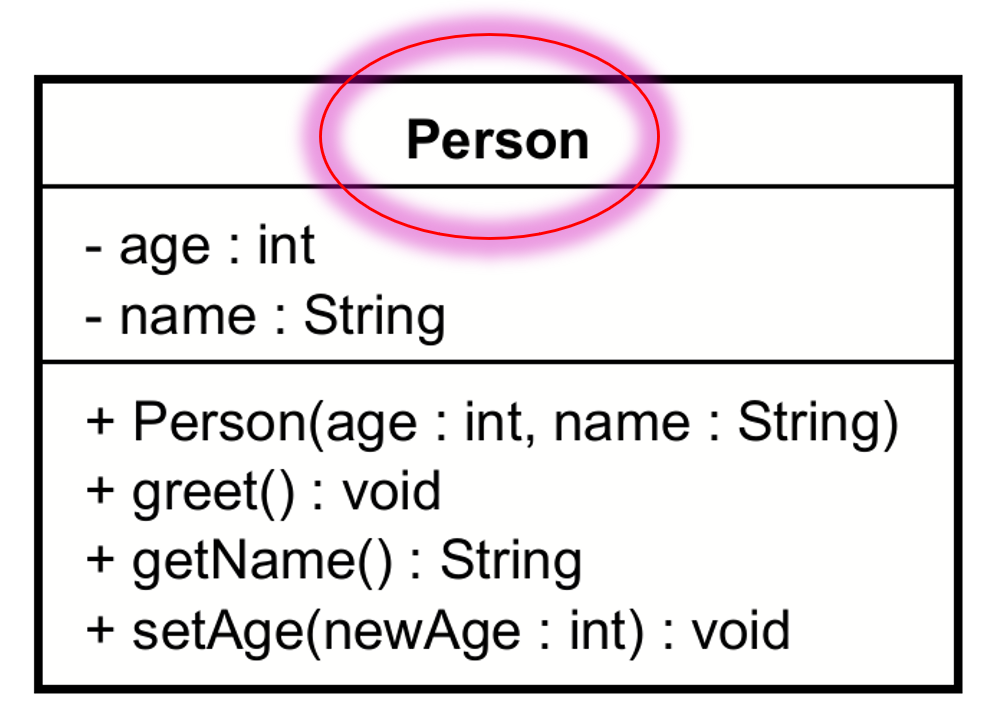
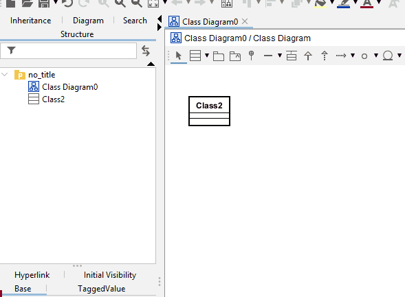

# Class name

At the top of the class box, we have the class name. Later you will also see other information here.

## Renaming in Astah

In the following gif, I show how to rename a class.\
You can double click on the class' name in the diagram.\
Or you can right click on the class in the project, and select "Rename".

Either way, the update will cascade to the diagram.

