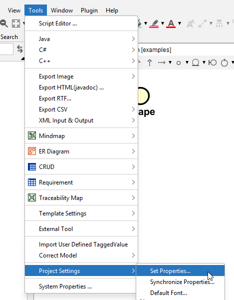

# Coloring elements in Astah

I will regularly recommend coloring elements in the diagram, to make it more readable.

In Astah, you can select an element, and then use the color picker at the top to change the color. But, doing this over and over again is tedious.

You can set the default color for an element

And then this menu shows up:

For each element type, you can set the default color.

There is also a tab for "Default Stereotype Color". A stereotype is a label that is added to an element to indicate its type. For example, a class can be a "class", an interface can be an "interface", or you can have "enum", "page", "component", and so on.