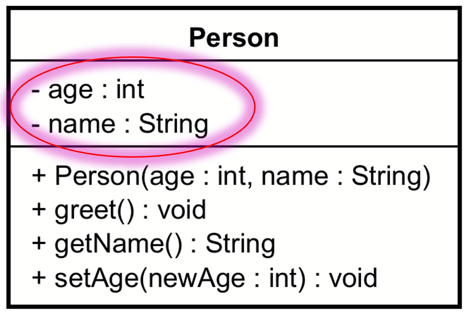

# Field variables

In the middle compartment of the class box, we have the attributes (fields) of the class. These represent the data that the class will hold.



Notice they are sort of defined opposite to what we do in Java: first the field name, then colon, then the field type. For example: `name : String` and `age : int`.

## UML Format

The format of a field variable in UML is:

```
visibility name : type
```

Where:
- `visibility` is the access modifier, one of `+`, `-`, `#`, or `~`.
- `name` is the name of the field.
- `type` is the type of the field.

Example:

```
+ name : String
- age : int
# ssn : String
~ internalId : String
```


## Adding field variables to a class in Astah

You have two options, the mouse over on the class box, or the left side panel.

### Mouse over, manual typing
Here is the mouse over, notice the yellow diamond icon (the green line is for methods).

The mouse over option is only available when nothing is selected. So, click empty space first.


By default, if you ignore the visibility, it will be made private. The default type is `int`. So, you don't necessarily need to write out everything. 	

### Left side panel, attribute tab
Alternatively, select a class, then attribute tab, and add a new attribute:

