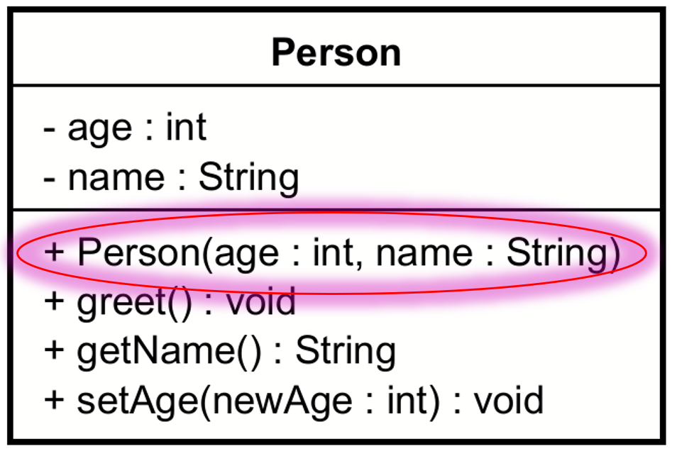

# Constructors

The bottom compartment holds the methods, and constructors are a special kind of methods, so they belong here too.

Notice the constructor in the below diagram is public (+), has the same name as the class, with the same casing. I.e. where Java methods are camelCase, constructors (and classes) are PascalCase. This is Java specific, not UML specific. Other languages may use different casing conventions.

The constructor does not have a return type, not even void. Compare the constructor with the other methods in the class, and observe the return types are at the end of each method.

Conventionally, constructors are the first of the methods.



## UML Format

The format of a constructor in UML is:
```
visibility name(parameters)
```

Where:
- `visibility` is the access modifier, one of `+`, `-`, `#`, or `~`.
- `name` is the name of the constructor.
- `parameters` is a comma separated list of parameters, in the format `parameterName : parameterType`.

Example:
```
+ Person(name : String, age : int)
```

## Adding a constructor to a class in Astah

### Mouse over, manual typing

When nothing is selected, you can mouse over the class box, and you will get a green line, which is for methods.

If you leave out the ": return type" part, you will get void as the default. So, you need to type in the ":", and then get an option to select the constructor.

If you don't explicitly specify the visibility, it will be made public.


### Left side panel, method tab

Alternatively, select a class, then method tab, and add a new method. But, this does not allow you to immediately input arguments. That is done under another tab.


This got cumbersome.