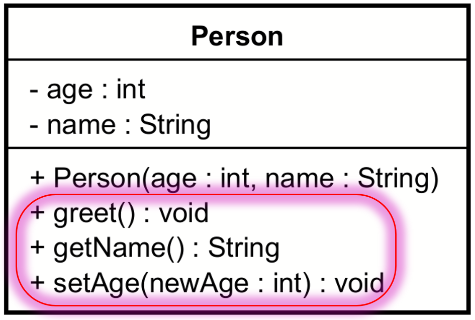

# Methods

In UML, methods are represented in the bottom compartment of the class diagram. They are shown with their visibility (public, private, protected) and their parameters.

For example, the `getName()` and `getAge()` methods from the previous example are public and have no parameters.



The corresponding Java code:

```java
public class Person {
    private String name;
    private int age;

    public String getName() {
        return name;
    }

    public int getAge() {
        return age;
    }
}
```

Notice the public visibility of the methods in the above snippet.

Methods can also be private in Java, in which case you just mark them with `-` in UML.

## Adding methods to a class in Astah

video here...