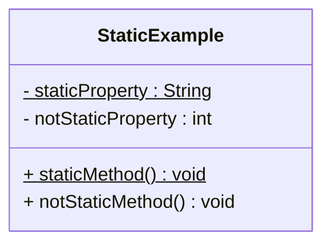
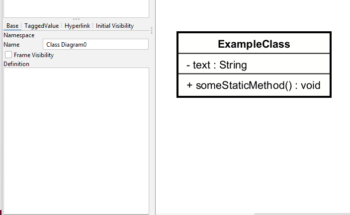

# Static methods and field variables

Static methods and field variables are <u>underlined</u> in UML class diagrams.

Here is an example:

```mermaid
classDiagram
    class StaticExample {
        - staticProperty : String$
        - notStaticProperty : int
        + staticMethod() void$
        + notStaticMethod() void
    }
```

## Marking something static in Astah

