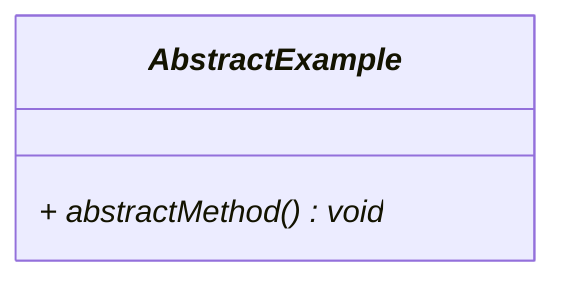
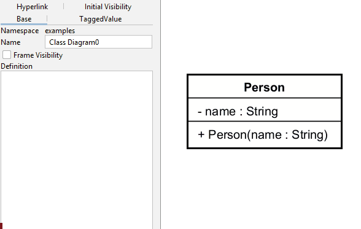

# Abstract classes and methods

Abstract classes and methods are represented in UML class diagrams by using *italics*.

Here is an example, notice both class name and method name are in italics, i.e. abstract.

## Marking something abstract in Astah

This is selected in the left side panel:

