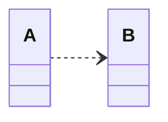
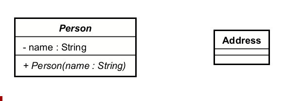
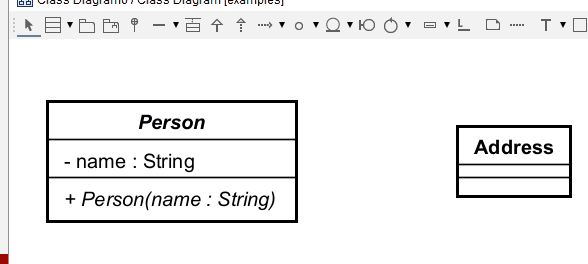

# Dependency Relationship

This is the weakest relationship, and is only shown selectively. 

## UML Format
The dependency in UML is a **dashed line** with an "open" arrowhead at one end, connecting two classes.

A points to B because A depends on B. But B does not know about A. Make sure the arrrow points in the correct direction.

## Adding a dependency in Astah

### Mouse over
If nothing is selected, you can mouse over a class box, close to an edge, and you will see a little [ **-** ▼ ] icon.\
The "dash" is the line type, and the "▼" opens a menu to select another type of line.

Here I am adding a dependency from Person to Address.

### Toolbox 

You can also choose the dependency tool from the toolbar at the top, then click the initial class, and then the target class.

